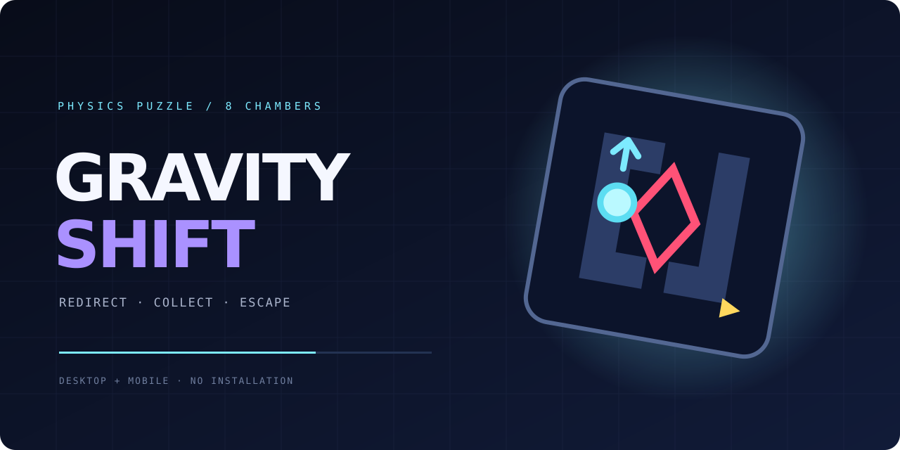

# Gravity Shift

Gravity Shift is a self-contained browser physics puzzle game. Redirect gravity, collect stars, avoid hazards, and reach the exit using as few shifts as possible.

## Highlights

- Eight handcrafted puzzle chambers
- Four-direction gravity plus clockwise, counterclockwise, and reverse controls
- Star collection, shift targets, best ratings, and level progression
- Responsive canvas rendering and automatic touch controls
- Pause, restart, sound, particle effects, and screen feedback
- Local progress with no account, server, installation, or internet dependency

## Play locally

Open `index.html` in Chrome, Edge, Firefox, or Safari. No build step is required.

## Controls

| Input | Action |
| --- | --- |
| Arrow keys / `WASD` | Set gravity direction |
| `Q` / `E` | Rotate gravity |
| `Space` | Reverse gravity |
| `R` | Restart the current chamber |
| `P` / `Escape` | Pause |

Touch controls appear automatically on mobile devices.

## Privacy

Progress and best star ratings stay in the browser through local storage. The game has no analytics, ads, purchases, accounts, external APIs, or data collection.

## Status

Playable prototype. Built as an experiment in physics-driven interaction, compact level design, responsive controls, and polished browser-game presentation.

Built by [Noah Krynicki](https://github.com/thacanadian).
